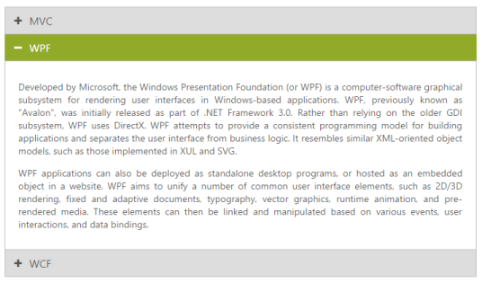

# AJAX settings

Accordion controls allow you to load content for the Accordion panel by using AJAX. This renders content from the specified URL location that is set to the anchor tag. You can set the destination file URL string by using AjaxUrl property AJAX contents enables you to load the content of the Accordion panel when it is expanded. This enhances the Accordion control efficiency when a large content is loaded into the panel.

## Populate accordion with AJAX content

Create HTML files with required content to be loaded for Accordion panel and save it in your drive location. 

File name: mvccontent.html



   
Model–view–controller (MVC) is a software architecture pattern which separates the representation of information from the user's interaction with it.

        The model consists of application data, business rules, logic, and functions. A view can be any output representation of data, such as a chart or a diagram. 

        Multiple views of the same data are possible, such as a bar chart for management and a tabular view for accountants. 

        The controller mediates input, converting it to commands for the model or view.The central ideas behind MVC are code reusable and in addition to dividing the application into three kinds of components, 

        the MVC design defines the interactions between them.

        <ul>

            <li>

                <b>A controller </b> can send commands to its associated view to change the view's presentation of the model (e.g., by scrolling through a document). 

                It can also send commands to the model to update the model's state (e.g., editing a document).

            </li>

            <li>

                <b>A model</b> notifies its associated views and controllers when there has been a change in its state. This notification allows the views to produce updated output, and the controllers to change the available set of commands. 

                A passive implementation of MVC omits these notifications, because the application does not require them or the software platform does not support them.

            </li>

            <li>

               <b>A view</b> requests from the model the information that it needs to generate an output representation to the user.

            </li>

        </ul>



File name: wpfcontent.html



    

        Developed by Microsoft, the Windows Presentation Foundation (or WPF) is a computer-software graphical subsystem for rendering user interfaces in Windows-based applications. 

        WPF, previously known as "Avalon", was initially released as part of .NET Framework 3.0. Rather than relying on the older GDI subsystem, WPF uses DirectX. 

        WPF attempts to provide a consistent programming model for building applications and separates the user interface from business logic. 

        It resembles similar XML-oriented object models, such as those implemented in XUL and SVG.

    

    

        WPF applications can also be deployed as standalone desktop programs, or hosted as an embedded object in a website. 

        WPF aims to unify a number of common user interface elements, such as 2D/3D rendering, fixed and adaptive documents, 

        typography, vector graphics, runtime animation, and pre-rendered media. These elements can then be linked and manipulated based on various events, 

        user interactions, and data bindings.

    



In the ASPX page, define the Accordion control and set the contents URL location to the AjaxUrl property.



    <ej:Accordion ID="BasicAccordion" runat="server">

        <Items>

            <ej:AccordionItem Text="MVC" AjaxUrl="mvccontent.html">

            </ej:AccordionItem>

            <ej:AccordionItem Text="WPF" AjaxUrl="wpfcontent.html">

            </ej:AccordionItem>

            <ej:AccordionItem Text="WCF">

                <ContentSection>

                        WCF is a tool often used to implement and deploy a service-oriented architecture (SOA).It is designed using service-oriented architecture principles to support distributed computing where services have remote consumers. Clients can consume multiple services; services can be consumed by multiple clients. Services are loosely coupled to each other. Services typically have a WSDL interface (Web Services Description Language) that any WCF client can use to consume the service, regardless of which platform the service is hosted on. WCF implements many advanced Web services (WS) standards such as WS-Addressing, WS-ReliableMessaging and WS-Security. With the release of .NET Framework 4.0, WCF also provides RSS Syndication Services, WS-Discovery, routing and better support for REST services.

                </ContentSection>

            </ej:AccordionItem>

        </Items>

    </ej:Accordion>



Output for Accordion control with loaded AJAX content is as follows.

 

