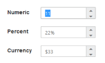

# Keyboard Interaction

With the keyboard navigation enabled in the CurrencyTextbox control, it is possible to control the actions with the shortcut keys. Almost all the CurrencyTextbox actions done through the mouse can be controlled with shortcut keys.

The various keyboard shortcuts available within the CurrencyTextbox control are in the following table. 

<table>
<tr>
<th>
{{ '**Shortcut Keys**' | markdownify }}</th><th>
{{ '**Description**' | markdownify }}</th></tr>
<tr>
<td>
{{ '[Access key](http://en.wikipedia.org/wiki/Access_key)' | markdownify }} + j</td><td>
Focuses the control</td></tr>
<tr>
<td>
Up</td><td>
Increments the value</td></tr>
<tr>
<td>
Down</td><td>
Decrements the value</td></tr>
<tr>
<td>
Tab</td><td>
Focus the next element</td></tr>
</table>

## Configuring Keyboard Navigation

The following steps explain the implementation of the keyboard interaction in the CurrencyTextbox.



<ej:CurrencyTextBox ID="currency" Value="33" runat="server"> </ej:CurrencyTextBox> 



Add the following code in your script section.



$(document).on("keydown", function (e) 

{

    if (e.altKey && e.keyCode === 74) 

    { // j- key code.

          $("#<%=currency.ClientID%>").siblings(".e-input").focus();

    }

});



Run the sample and press [Access key](http://en.wikipedia.org/wiki/Access_key) + j key to focus the Textbox control. Perform provided functionality by using the keyboard shortcuts.

