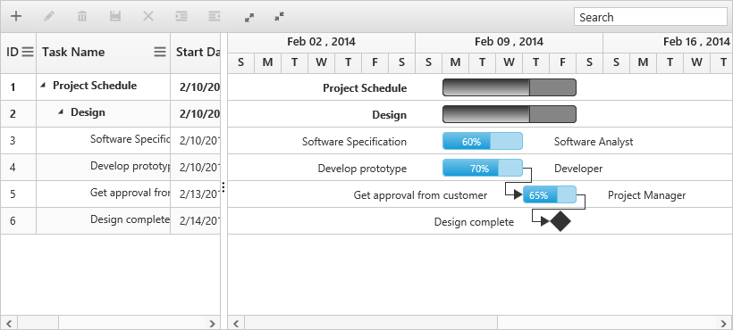

# Resources

Resources are represented by staff, equipment and materials etc. In Gantt control you can show /allocate the resources (human resources) for each task.

## Resource Collection

Resource collection contains details about the resources that are used in the project. Resources are `List` object that contains id and name of the resources and this collection is mapped to the Gantt control using `Resources` property.
Id and name field of the resources are mapped by using the `ResourceIdMapping` and `ResourceNameMapping` properties.
The following code snippets shows resource collection object and how it assinged to Gantt control.




protected void Page_Load(object sender, EventArgs e)
{
    //...
    this.GanttContainer.Resources = this.GetResources();
}

// Create resource collection
 public class Resource
 {
     public int ResourceId { get; set; }
     public string ResourceName { get; set; }
 }
 //...

 public List<Resource> GetResources()
 {
     List<Resource> ResourceCollection = new List<Resource>();
     ResourceCollection.Add(new Resource() { ResourceId = 1, ResourceName = "Project Manager" });
     ResourceCollection.Add(new Resource() { ResourceId = 2, ResourceName = "Software Analyst" });
     ResourceCollection.Add(new Resource() { ResourceId = 3, ResourceName = "Developer" });
     ResourceCollection.Add(new Resource() { ResourceId = 4, ResourceName = "Testing Engineer" });
     return ResourceCollection;
 }





<ej:Gantt ID="GanttContainer" runat="server" ResourceIdMapping="ResourceId" ResourceNameMapping="ResourceName">
</ej:Gantt>



  

## Assign Resource
We can assign resources for a task at initial load, using the resource id value of the resources as a collection. This collection is mapped  from the `DataSource` to the Gantt control using the `ResourceInfoMapping` property.
The following code snippet shows how to assign the resource for each task and map to Gantt control.





protected void Page_Load(object sender, EventArgs e)
{
    //...
    this.GanttContainer.DataSource = this.GetData();
    this.GanttContainer.Resources = this.GetResources();
}

public class ResourceData
{
    //...
    public List<int> Resources { get; set; }
}

public List<ResourceData> GetData()
{
    //..
    List<ResourceData> list = new List<ResourceData>();
    list.Add(new ResourceData()
        {
            //...
            Resources =new List<int>(){2},
            //..
        }
}





<ej:Gantt ID="GanttContainer" runat="server" 
    ResourceInfoMapping="Resources" ResourceIdMapping="ResourceId" ResourceNameMapping="ResourceName">
</ej:Gantt>



  

The following screenshot shows Gantt control with resources.

## Assign Resources with Unit
Resource units indicates the amount of work done by a resource for the task. We can specify the resource unit for the each assigned resource for a particular task.
Resource unit value is mapped to the Gantt tasks from the datasource using `ResourceUnitMapping` property.
The below code snippets shows how to assign resource unit value.





protected void Page_Load(object sender, EventArgs e)
{
    //...
    this.GanttContainer.DataSource = this.GetData();
    this.GanttContainer.Resources = this.GetResources();
}

public class ResourceObject
{
    public int ResourceId { get; set; }
    public int ResourceUnit { get; set; }
}

public class ResourceData
{
    //...
    public List<ResourceObject> Resources { get; set; }
}

public List<ResourceData> GetData()
{
    //..
    List<ResourceData> list = new List<ResourceData>();
    list.Add(new ResourceData()
        {
            //...
            Resources = new List<ResourceObject>(){ new ResourceObject(){ ResourceId=2, ResourceUnit=50}},
            //..
        }
}





<ej:Gantt ID="GanttContainer" runat="server" 
    ResourceInfoMapping="Resources" ResourceUnitMapping="ResourceUnit" ResourceIdMapping="ResourceId" ResourceNameMapping="ResourceName">
</ej:Gantt>



  

The following screenshot shows Gantt control with resource units.

## Edit Resource Collection
By using cell edit option we can add/remove the resource for particular task and by using dialog edit support we can modify the resource unit value also.
Refer this [link](/aspnet/gantt/editing) to know more about editing in Gantt control.
The following screenshot shows the resource edit option in Gantt.

Editing resource with cell edit
{:.caption}

Editing resource with edit dialog
{:.caption}

N> While editing, resource values are saved with resource unit value when resource unit is not equal to 100% like below.

   {
       "taskId": 3,
        //...
	    "resourceId": [{ resourceId: 2, unit: 50 }]
    }

N> When resource unit is 100%, resource value is stored with ID only.

    {
       "taskId": 3,
        //...
	    "resourceId": [2]
    }

N> The unit values are updated to the resources assigned to the Gantt tasks, only when mapping resource units data source field using the `ResourceUnitMapping` property.
N> Resource unit will be updated while editing the duration and work fields with respective to task type.