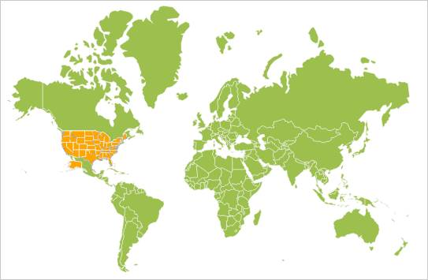

# Layers

Map is maintained through Layers and it can accommodate one or more layers.

## Multilayer

The Multilayer support allows you to load multiple shape files in a single container, enabling maps to display more information.

## Loading Multiple Shape files in a Single Container

This feature allows the map to load multiple types of shape files in a single container.

## Adding Multiple Layers in the Map 

The shape layers is the core layer of the map. The multiple layers can be added in the shape Layers as SubShapeFileLayers within the shape Layers.

## SubLayer

The subLayer is the collection of shape Layers. 

In this example, World Map shape is used as shape data by utilizing the “WorldMap.json” file in the following folder structure obtained from downloaded Maps_GeoJSON folder.

..\ Maps_GeoJSON\



  <ej:Map ID="map" runat="server" >

     <Layers>                

           <ej:ShapeLayer>

            <ShapeSettings Fill = "#9CBF4E" StrokeThickness = "0.2" Stroke = "white">

            </ShapeSettings> 

            <SubLayers>

              <ej:ShapeLayer>

                <ShapeSettings Fill = "orange" StrokeThickness = "1" Stroke =        "white">

            </ShapeSettings>

           </ej:ShapeLayer>

            </SubLayers>         

            </ej:ShapeLayer>

        </Layers>

    </ej:Map>



Map with layers
{:.caption} 

