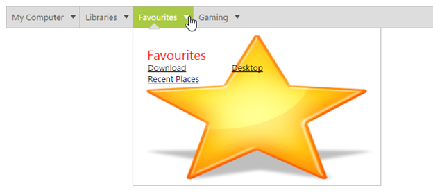

# Appearance and Styling

## Theme

Essential Studio ASP.NET controls feature 13 built-in themes, six flat and gradient effects, and also supports custom skin options for user-defined themes.

13 themes support available for menu control namely,

* default-theme
* flat-azure-dark
* flat-lime
* flat-lime-dark
* flat-saffron
* flat-saffron-dark
* gradient-azure
* gradient-azure-dark
* gradient-lime
* gradient-lime-dark
* gradient-saffron
* gradient-saffron-dark
* bootstrap-theme

Syncfusion provides a CSS file named **ej.web.all.min.css** for each of the above specified theme, which can be referred in your application, in order to apply the appropriate theming styles to the widgets. All the above specified theme files are available within the **css** folder.

## Adding specific theme to your application

This section explains what are all the files required to refer and the steps to apply the **flat-saffron** theme. 

1. Create the following folders in the same structure under your application folder. 

N>   app folder\Content\ej\flat-saffron

2. Copy **common-images** folder & **ej.widgets.core.min.css** file into the `appfolder\Content\ej`

N> Both of these folders and files are mandatory for any themes. 

3. Copy the CSS files available in the installed location of the flat-saffron folder into your app location `appfolder\Content\ej\flat-saffron`
4. Refer the **ej.web.all.min.css** file in your HTML page within the `<head>` section before making any script reference as shown below,



<!DOCTYPE html>
<html xmlns="http://www.w3.org/1999/xhtml">
<head>
<title>Adding specific theme to your application</title>
<link href="Content/ej/web/flat-saffron/ej.web.all.min.css" rel="stylesheet">
</head>
</html>



## CssClass

Menu control also customizes its appearance by using user-defined CSS and custom skin options (colors and backgrounds). To apply custom themes, “CssClass” property is used. “CssClass” property sets the root class for Menu control theme.

By using CssClass you can override the existing styles under the theme style sheet. The theme stylesheet applies theme-specific styles like colors and backgrounds. In the following code example, the value of “CssClass” property is set as “Purple-dark”. Purple-dark is added as root class to Menu control at the runtime. From this root class you can customize the Menu control theme.

Add the following code in your ASPX page.



        <ej:Menu ID="MenuControl" Width="500" CssClass="Purple-dark" runat="server">

            <Items>

                <ej:MenuItem Id="Home" Text="Home">

                    <Items>

                        <ej:MenuItem Text="Foundation"></ej:MenuItem>

                    </Items>

                    <Items>

                        <ej:MenuItem Text="Launch"></ej:MenuItem>

                    </Items>

                    <Items>

                        <ej:MenuItem Text="About">

                            <Items>

                                <ej:MenuItem Text="Company"></ej:MenuItem>

                            </Items>

                            <Items>

                                <ej:MenuItem Text="Location"></ej:MenuItem>

                            </Items>

                        </ej:MenuItem>

                    </Items>

                </ej:MenuItem>

                <ej:MenuItem Id="Services" Text="Services">

                    <Items>

                        <ej:MenuItem Text="Consulting"></ej:MenuItem>

                    </Items>

                    <Items>

                        <ej:MenuItem Text="Outsourcing"></ej:MenuItem>

                    </Items>

                </ej:MenuItem>

                <ej:MenuItem Id="About" Text="About"></ej:MenuItem>

                <ej:MenuItem Id="Contact" Text="Contact us">

                    <Items>

                        <ej:MenuItem Text="Contact Number"></ej:MenuItem>

                    </Items>

                    <Items>

                        <ej:MenuItem Text="Email"></ej:MenuItem>

                    </Items>

                </ej:MenuItem>

                <ej:MenuItem Id="Careers" Text="Careers">

                    <Items>

                        <ej:MenuItem Text="Position">

                            <Items>

                                <ej:MenuItem Text="Developer"></ej:MenuItem>

                            </Items>

                            <Items>

                                <ej:MenuItem Text="Manager"></ej:MenuItem>

                            </Items>

                        </ej:MenuItem>

                    </Items>

                    <Items>

                        <ej:MenuItem Text="Apply online"></ej:MenuItem>

                    </Items>

                </ej:MenuItem>

            </Items>

        </ej:Menu>



Add the following code in your style section.



      .Purple-dark .e-menu,.e-menu.e-horizontal .e-list > ul {     
         
       background: pink;              
     
     }
     
     
    
    .Purple-dark .e-menu.e-horizontal .e-list > a {    
    
      color: blue;      
      
     }



Following screenshot displays the output of the above code example.

 

## Background Template

Menu control also provide the support for template support. Normally menu control can be created by using UL and LI tags in the preferred way. In template supporting, you can customize the appearance of sub menu items rendering. 

Initialize the Template Menu as illustrated in the following code example. 

Add the following code example in your ASPX page.



<ej:Menu ID="template" runat="server">

        <Items>

            <ej:MenuItem Text="My Computer">

                <Items>

                    <ej:MenuItem Text="Child1">

                        <Template>

                            

                                Disks

                                <ul>

                                    <li><a>Local Disk : C</a></li>

                                    <li><a>Local Disk : D</a></li>

                                </ul>

                                <ul>

                                    <li><a>Local Disk : E</a></li>

                                    <li><a>Local Disk : F</a></li>

                                </ul>

                            

                        </Template>

                    </ej:MenuItem>

                </Items>

            </ej:MenuItem>

            <ej:MenuItem Text="Libraries">

                <Items>

                    <ej:MenuItem Text="Child1">

                        <Template>

                            

                                

                                    Documents

                                    <ul>

                                        <li><a>Images</a></li>

                                        <li><a>Videos</a></li>

                                    </ul>

                                    <ul>

                                        <li><a>Documents</a></li>

                                        <li><a>Music</a></li>

                                    </ul>

                                

                            

                        </Template>

                    </ej:MenuItem>

                </Items>

            </ej:MenuItem>

            <ej:MenuItem Text="Favourites">

                <Items>

                    <ej:MenuItem Text="Child1">

                        <Template>

                            

                                

                                    Favorites

                                    <ul>

                                        <li><a>Download</a></li>

                                        <li><a>Recent Places</a></li>

                                    </ul>

                                    <ul>

                                        <li><a>Desktop</a></li>

                                    </ul>

                                

                            

                        </Template>

                    </ej:MenuItem>

                </Items>

            </ej:MenuItem>

            <ej:MenuItem Text="Gaming">

                <Items>

                    <ej:MenuItem Text="Child1">

                        <Template>

                            

                                

                                    GAMING

                                    <ul>

                                        <li><a>Upcoming</a></li>

                                        <li><a>Consoles</a></li>

                                    </ul>

                                    <ul>

                                        <li><a>FIFA 2999</a></li>

                                        <li><a>Carom legend</a></li>

                                    </ul>

                                

                            

                        </Template>

                    </ej:MenuItem>

                </Items>

            </ej:MenuItem>

        </Items>

    </ej:Menu>



Add the following code example in your style section



    .temp {

        height: 237px;

        width: 375px;

        font-family: segoe UI;

        cursor: default;

        background-size: 100% 100%;

    }

        .temp span {

            color: red;

            float: left;

            font-size: 20px;

            left: 20px;

            position: relative;

            top: 25px;

            width: 100px;

        }

        .temp ul {

            float: left;

            font-size: 14px;

            left: -79px;

            list-style-type: none;

            margin: 0;

            padding: 0;

            position: relative;

            top: 50px;

            width: 128px;

        }

            .temp ul li {

                font-size: 13px;

            }

                .temp ul li a {

                    text-decoration: underline;

                    cursor: pointer;

                    color: #000;

                }

    .temp1 {

        background-image: url("1.jpg");

    }

    .temp2 {

        background-image: url("2.jpg");

    }

    .temp3 {

        background-image: url("3.jpg");

    }

    .temp4 {

        background-image: url("4.jpg");

    }

    .e-menu.e-horizontal li > ul, .e-menu.e-horizontal li > ul > li:hover {

        background-color: #fff;

    }

    .e-menu.e-horizontal > li > ul:after {

        border-color: transparent transparent #fff;

    }



Execute the above code example to render the following output.                       

