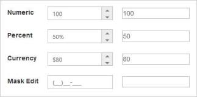
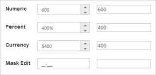

# Integration

## KnockoutJS Support

KnockoutJS support allows you to bind the HTML elements against any of the available data models. It is of two types.

* One-way binding
* Two-way binding

One-way binding refers to the process of applying observable values to all the available properties of the PercentageTextbox control, but the changes made in PercentageTextbox control are not reflected and triggered in turn to the observable collection. This kind of binding applies to all the properties of the PercentageTextbox control.

Two-way binding supports both the processes; it applies the observable values to the PercentageTextbox control properties as well as the changes made in the PercentageTextbox control are also reflected back and triggered within the observable collections.

For more information about the Knockout Binding, refer to the following online documentation link.

<http://help.syncfusion.com/js/knockoutjs>

The following example depicts the way to bind data to the PercentageTextbox control through Knockout Support that enables and populates data to the PercentageTextbox control based on the value set to the other PercentageTextbox control.



<!DOCTYPE html>

<html xmlns="http://www.w3.org/1999/xhtml">

<head>

    <title></title>

    <link href="Content/bootstrap.min.css" rel="stylesheet" />

    <link href=" http://cdn.syncfusion.com/ {{site.releaseversion}}/js/web/flat-azure/ej.web.all.min.css" rel="stylesheet" />

    

    

    

    

    

</head>

<body>

    

        <table cellpadding="10">

            <tbody>

                <tr>

                    <td>

                        <label for="percent">Percent</label>

                    </td>

                    <td>

                        <input id="percent" type="text" data-bind="ejPercentageTextbox: { value: percentValue }" />

                    </td>

                    <td>

                        <input type="text" class="input ejinputtext" data-bind="value: percentValue" />

                    </td>

                </tr>

            </tbody>

        </table>

    

    

</body>

</html> 



The output of Knockout binding in PercentageTextbox.

## AngularJS Support

The PercentageTextbox control supports two types of AngularJS support namely,

* One-way binding
* Two-way binding

One-way binding refers to the process of applying scope values to all the available properties of the PercentageTextbox control, but the changes made in PercentageTextbox control are not reflected or triggered in turn to the scope collection. This kind of binding applies to all the properties of the PercentageTextbox control.

Two-way binding supports both the processes; it applies the scope values to the PercentageTextbox properties as well as the changes made in the PercentageTextbox control also get reflected back and triggered within the AngularJS scope change function.

Apply the plugin and property assigning to the PercentageTextbox control element through the directive that starts with the letter “e-“.

To know more details about the Angular binding, refer to the following link location,

<http://help.syncfusion.com/js/angularjs>

The following example depicts the way to bind data to the PercentageTextbox control through Angular Support.



<!DOCTYPE html>

<html xmlns="http://www.w3.org/1999/xhtml" ng-app="TextCtrl">

<head>

    <title></title>

    <link href="Content/bootstrap.min.css" rel="stylesheet" />

    <link href=" http://cdn.syncfusion.com/ {{site.releaseversion}}/js/web/flat-azure/ej.web.all.min.css" rel="stylesheet" />

    

      

    

    

    

</head>

<body ng-controller="TextboxCtrl">

    

        <table cellpadding="10">

            <tbody>

                 <tr>

                    <td>

                        <label for="percent">Percent</label>

                    </td>

                    <td>

                        <input id="percent" type="text" ej-percentagetextbox e-value="percentValue" />

                    </td>

                    <td>

                        <input type="text" class="input ejinputtext" ng-model="percentValue" />

                    </td>

                </tr>

            </tbody>

        </table>

    

    

</body>

</html>



The output of PercentageTextbox controls with two-way AngularJS binding is as follows.

