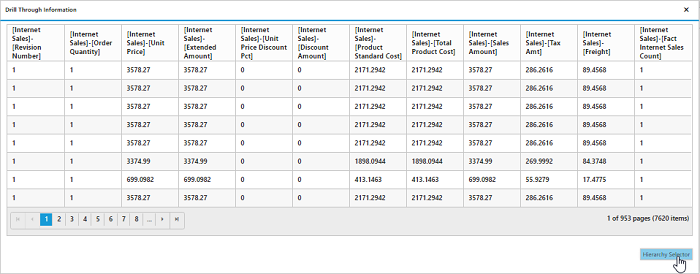
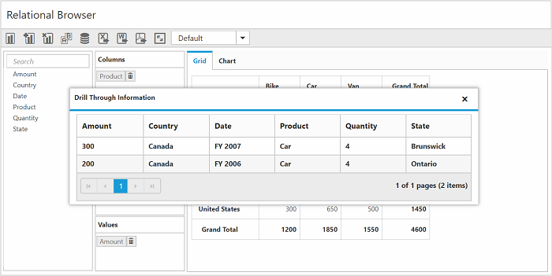

# Drill through

The drill-through retrieves the raw items that are used to create a specified cell. To enable drill-through support, set the [`EnableDrillThrough`] property to true. Raw items are obtained through the [`DrillThrough`] event, using which you can bind them to an external widget for a precise view.

N> Drill-through is supported in the pivot grid only when you configure and enable the drill-through action at the cube.

By clicking any value cell, the Drill Through Information dialog will be opened. It consists of grid with the data that are associated with measure values of the clicked value cell. In this example, the measure behind the respective cell is “Sales Amount” and the values of the dimensions that are associated with this measure are alone displayed in the grid.

By clicking the Hierarchy Selector button that is displayed below the grid, the Hierarchy Selector dialog will be opened. It consists of dimensions that are associated with the measure of clicked value cell. In this example, the measure behind the respective cell is “Sales Amount” and the dimensions associated with this measure are alone displayed in the dialog.

Drag and drop the respective hierarchies and click OK. The drill through MDX query will be framed and executed internally and provides back the raw items through "DrillThrough" event. In this example, the obtained raw items are bounded to the ejGrid widget. Refer to the following code sample and screenshot:

## OLAP

### Client mode



<ej:PivotClient ID=" PivotClient1" runat="server" EnableDrillThrough="true" ClientIDMode="Static">
        //...
        <ClientSideEvents DrillThrough="drilledData" />
</ej:PivotClient>



### Server mode



<ej:PivotClient ID=" PivotClient1" Url="/Olap" runat="server" EnableDrillThrough="true" ClientIDMode="Static">
        //...
        <ClientSideEvents DrillThrough="drilledData" />
</ej:PivotClient>



When, the pivot grid is rendered in server mode, the following service methods should be added in the WCF/WebAPI for drill through operation:

For WebAPI controller, the following methods should be added:



[System.Web.Http.ActionName("DrillThroughHierarchies")]
[System.Web.Http.HttpPost]
public string DrillThroughHierarchies(Dictionary<string, object> jsonResult)
{
    OlapDataManager DataManager = new OlapDataManager(connectionString);
    DataManager.SetCurrentReport(OLAPUTILS.Utils.DeserializeOlapReport(jsonResult["currentReport"].ToString()));
    return pivotClientHelper.DrillthroughHierarchies(DataManager, jsonResult["layout"].ToString(), jsonResult["cellPos"].ToString());
}

[System.Web.Http.ActionName("DrillThroughDataTable")]
[System.Web.Http.HttpPost]
public Dictionary<string, object> DrillThroughDataTable(Dictionary<string, object> jsonResult)
{
    OlapDataManager DataManager = new OlapDataManager(connectionString);
    DataManager.SetCurrentReport(OLAPUTILS.Utils.DeserializeOlapReport(jsonResult["currentReport"].ToString()));
    return pivotClientHelper.DrillthroughDataTable(DataManager, jsonResult["layout"].ToString(), jsonResult["cellPos"].ToString(), jsonResult["selector"].ToString());
}



For WCF service, the following methods should be added:



public string DrillThroughHierarchies(string currentReport, string layout, string cellPos)
{
    OlapDataManager DataManager = new OlapDataManager(connectionString);
    DataManager.SetCurrentReport(OLAPUTILS.Utils.DeserializeOlapReport(currentReport));
    return pivotClientHelper.DrillthroughHierarchies(DataManager, layout, cellPos);
}

public Dictionary<string, object> DrillThroughDataTable(string currentReport, string layout, string cellPos, string selector)
{
    OlapDataManager DataManager = new OlapDataManager(connectionString);
    DataManager.SetCurrentReport(OLAPUTILS.Utils.DeserializeOlapReport(currentReport));
    return pivotClientHelper.DrillthroughDataTable(DataManager, layout, cellPos, selector);
}



## Relational

To enable drill-through support, set the `enableDrillThrough` property to true. Raw items are obtained through the `drillThrough` event.



<ej:PivotClient ID=" PivotClient1" Url="/Olap" runat="server" EnableDrillThrough="true" ClientIDMode="Static">
        //...
        <ClientSideEvents DrillThrough="drilledData" Load="onLoad" />
</ej:PivotClient>



