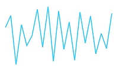

# Getting Started

This section explains you the steps required to populate the Sparkline with data. This section covers only the minimal features that you need to know to get started with the Sparkline.

## Installation and Deployment

It describes you on how to configure the Syncfusion dependencies in your ASP.NET application to create a Sparkline.

### Referencing Syncfusion Assemblies

The following assemblies need to be referenced in your application for using Essential Sparkline ASP

1. Syncfusion.EJ.dll
2. Syncfusion.EJ.Web.dll

Follow the steps given below to deploy the application in the development server by referencing the assembly in **GAC**.

* Web.config file should be configured according to the referenced assemblies. 
* To deploy your application, you have to ensure that the above referenced assemblies (in your web.config files) are present in the GAC.

And, add Syncfusion namespace in the Web.config file.

 

N> If you are referring Syncfusion dll's manually from bin folder to create ASP Sparkline, then remove Culture, Version and PublicKeyToken attributes used in all files.

###  Adding script reference

By default, Syncfusion JavaScript source files has been included into the EJ.Web assembly as an embedded source. So we no need to refer jQuery and Syncfusion scripts externally. For debugging purpose want to refer script files externally, set false to **LoadEJResourcesFromAssembly** in Web.config file as shows in the below image and refer jQuery and Syncfusion script files.

 



    <!--  jquery script  -->
    
    
    <!-- Essential html UI widget -->
    
    


## Initialize Sparkline

Add the following code in the default.aspx file to create the Sparkline control in View page.



   <ej:Sparkline ClientIDMode="Static" ID="Container" runat="server">
   </ej:Sparkline>



Now, the Sparkline is rendered with some auto-generated random values and with default Line type Sparkline.

