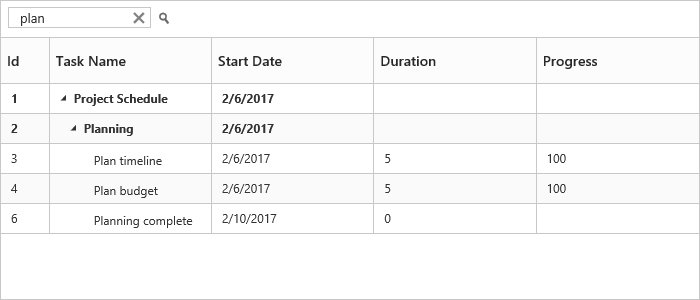

# Searching in ASP.NET Web Forms TreeGrid

The TreeGrid control has an option to search its content using toolbar search box. The toolbar search box can be enabled by using the `ToolbarSettings.ToolbarItems` property. The following code example explains how to integrate search textbox in toolbar.



    <ej:TreeGrid ID="TreeGrid" runat="server">
        <ToolbarSettings ShowToolbar="true" ToolbarItems="search" />            
    </ej:TreeGrid>



The below screenshot shows TreeGrid search with `plan` key word.

## Search Hierarchy Modes

The tree grid supports different types of search mode through the `SearchSettings.SearchHierarchyMode` property.

The following are the types of search modes available in the tree grid.

**Parent**: This is the default search hierarchy mode in the tree grid. It displays a searched record with its parent records. If the searched records do not have any parent record, it displays only the searched record.

**Child**: Displays the searched record with its child record. If the searched records do not have any child record, it displays only the searched record.

**Both**: Displays the searched record with both its parent and child records. If the searched records do not have any parent and child records, it displays only the searched record.

**None**: Displays only the searched record.

The following code example shows how to set the `SearchHierarchyMode` in the tree grid.



<ej:TreeGrid runat="server" ID="TreeGridControlDefault">
     //...
     <SearchSettings SearchHierarchyMode="Child"/>
</ej:TreeGrid>



The following image depicts the output of the previous code example.

The above screenshot shows Tree Grid with `Child` search mode.

